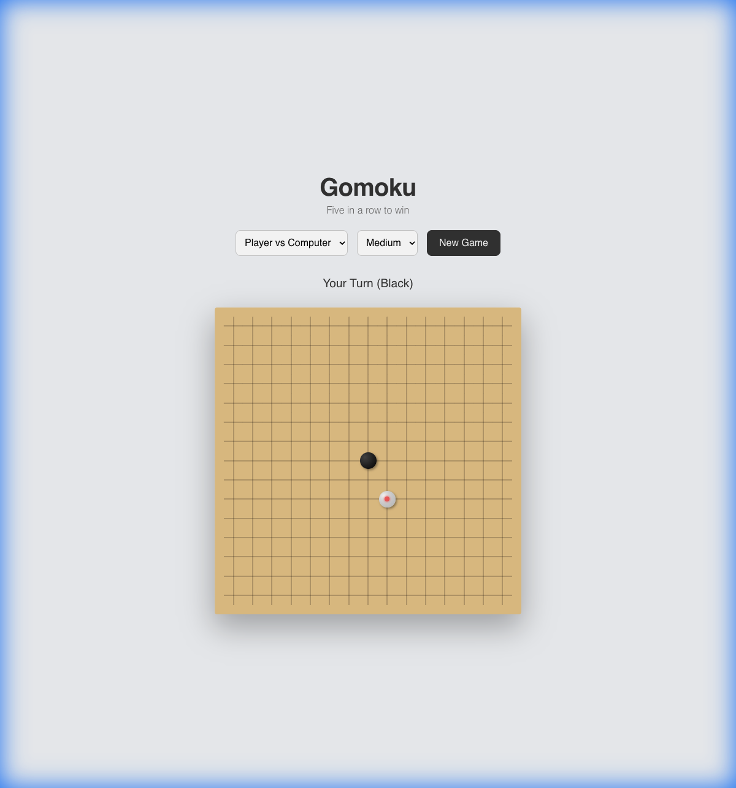

# Gomoku React Implementation Walkthrough

The Gomoku game has been successfully refactored into a modern **React.js** application using Vite.

## Technical Architecture

### 1. Component Structure
The application is built with a functional component architecture:
- **App.jsx**: The main container managing the entire game state.
    - **State**: `board`, `currentPlayer`, `gameMode`, `difficulty`, etc.
    - **Effects**: Handles the AI turn delay and logic execution.
- **gameLogic.js**: A pure JavaScript utility module containing:
    - `checkWin()`: Efficient 5-in-a-row detection.
    - `getComputerMove()`: The AI decision engine (Easy/Medium/Hard).
    - `evaluatePosition()`: Heuristic scoring for the AI.

### 2. Styling
- Ported the original CSS to `App.css`.
- Maintained the variable-based theming for easy adjustments to colors and board resizing.

### 3. Features Preserved
- **PvP & PvE Modes**: Seamless switching with state resets.
- **Difficulty Levels**: Easy, Medium, Hard AI integration working correctly.
- **Visual Feedback**: Hover shadows, last move markers, and winning line highlights.

## Verification
- **Automated Testing**: Verified the React app renders correctly, handles PvP turns, and supports AI interaction in all difficulty modes.
- **Visuals**: Confirmed that the premium wood texture and 3D stone effects are identical to the vanilla version.

## Testing
Comprehensive automated tests have been added using **Vitest** and **React Testing Library**.

### Running Tests
Run the following command in the `gomoku-react` directory:
```bash
npx vitest run
```

### Test Scope
- **Game Logic** (`src/gameLogic.test.js`):
    - Board initialization.
    - Win detection (horizontal, vertical, diagonal).
    - AI strategy verification (blocking & winning).
- **Components** (`src/App.test.jsx`):
    - App rendering.
    - Interaction flow (placing stones, turn switching).
    - Game reset functionality.


